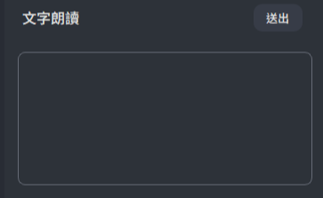

# NOVA CHAT 設置教學

### 1. 設置 VTube Studio
+ 打開並啟動 VTube Studio 應用程式。

  
+ 進入 VTube Studio 的 API 設置欄，輸入 API 密鑰 8051，並點擊 “確認 API 調用” 按鈕。

  
### 2. 配置 NOVA CHAT 應用程式
+ 打開 NOVA CHAT 應用程式。
+ 點擊 "設定" 按鈕，Vtube Studio 會提示是否同意掛載第三方應用程式，確認即可。
  
  
### 3. 使用 NOVA CHAT 功能
+ 您可以通過鍵盤輸入，按下 Enter 或點擊 “送出” 按鈕來發送訊息。

  
+ 連接 YouTube 直播間: 輸入 YouTube 直播間的連結，NOVA CHAT 會自動抓取聊天室內容。

  