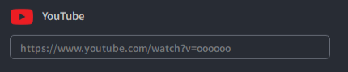

# NOVA CHAT Setup Guide

### 1. Set Up VTube Studio
+ Open the VTube Studio application.

  
+ Go to the API settings in VTube Studio, enter the API key 8051, and click the "Confirm API Call" button.

  
### 2. Configure the NOVA CHAT Application
+ Open the NOVA CHAT application.
+ Click the "Settings" button. VTube Studio will prompt you to confirm whether to mount the third-party application. Click confirm.
  
  
### 3. Use NOVA CHAT Features
+ You can type messages using your keyboard, then press Enter or click the "Send" button to submit.

  
+ Connect to YouTube Livestream: Enter the link to the YouTube livestream, and NOVA CHAT will automatically capture the chatroom content.

  
